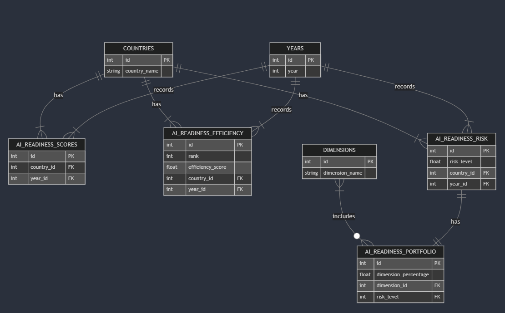

# Design Document

By Doroteja Mitrović

Video overview: <(https://youtu.be/f_Wiq_YCtkw)>

## Scope

In this section you should answer the following questions:

* What is the purpose of your database?
The database analyzes AI readiness across 151 countries from 2020 until 2023. It includes AI readiness scores, efficiency scores of using resources in AI implementation, risk levels associated with AI adoption, and recommended portfolio strategies for improvement of AI readiness.
* Which people, places, things, etc. are you including in the scope of your database?
The database focuses on 151 countries that consistently appear in all three datasets.
* Which people, places, things, etc. are *outside* the scope of your database?
Countries that do not have complete data across all datasets from 2020 until 2023.

## Functional Requirements

In this section you should answer the following questions:

* What should a user be able to do with your database?
Users can:
    1. Analyze how AI readiness scores have changed over time for each country.
    2. Identify which countries are performing well and can serve as benchmarks for others.
    3. Examine risk levels associated with AI implementation in each country.
    4. Determine the most suitable investment portfolio to improve AI readiness, based on risk levels.
    5. Compare Oxford’s AI readiness scores with efficiency scores from DEA analysis, identifying discrepancies.
* What's beyond the scope of what a user should be able to do with your database?
    1. The database does not predict future improvements in AI readiness
    2. It does not determine how much a specific improvement in a dimension will increase AI readiness.
    3. It does not provide policy recommendations for governments beyond the portfolio suggestions.

## Representation

Entities are captured in SQLite tables with the following schema.

### Entities

#### Countries

The countries table includes:
* id, which specifies the unique ID for the country as an INTEGER. This column has the PRIMARY KEY constraint applied, and AUTOINCREMENT was added so that each new country gets a unique, auto-incrementing ID.
* country_name, which specifies the name of the country as TEXT, as this data type is appropriate for name fields. This field must not be empty, so the NOT NULL constraint was added.

#### Years

The years table includes:
* id, which specifies the unique ID for the year as an INTEGER. This column has the PRIMARY KEY constraint applied, and AUTOINCREMENT was added so that each new year gets a unique, auto-incrementing ID.
* year, which specifies the year when the data was collected. INTEGER was used, as SQLite does not have a specific data type for years. This field must not be empty, so the NOT NULL constraint was added. Additionally, since each year should appear only once, the UNIQUE constraint was added.

#### Dimensions

The dimensions table includes:
* id, which specifies the unique ID for the dimension as an INTEGER. This column has the PRIMARY KEY constraint applied, and AUTOINCREMENT was added so that each new dimension gets a unique, auto-incrementing ID.
* dimension_name, which specifies the name of the dimension as TEXT, as this data type is appropriate for name fields. This field must not be empty, so the NOT NULL constraint was added.

#### ai_readiness_scores

The ai_readiness_scores table includes:
* id, which specifies the unique ID for each AI readiness score that countries receive per year as an INTEGER. This column has the PRIMARY KEY constraint applied, and AUTOINCREMENT was added so that each new score gets a unique, auto-incrementing ID.
* ai_readiness_scores wwhich specifies the AI readiness score received by each country as a REAL number. The NOT NULL constraint ensures each entry has a valid score.
* country_id, which represents the ID of the researched country as an INTEGER. Since it must not be empty, the NOT NULL constraint was added.
* year_id, which represents the ID of the year in which the data was collected as an INTEGER. Since it must not be empty, the NOT NULL constraint was added.
* dimension_id, which represents the ID of the dimension being measured as an INTEGER. Since it must not be empty, the NOT NULL constraint was added.

#### ai_readiness_efficiency

The ai_readiness_efficiency table includes:
* id, which specifies the unique ID for each efficiency record as an INTEGER. This column has the PRIMARY KEY constraint applied, and AUTOINCREMENT ensures that each new record gets a unique, auto-incrementing ID.
* rank, which specifies the ranking of a country based on its AI efficiency score as an INTEGER. Since this value must not be empty, the NOT NULL constraint was added.
* efficiency_score, which represents the AI efficiency score of the country as a REAL number. Since every country must have a valid efficiency score, the NOT NULL constraint was added.
* country_id, which represents the ID of the country as an INTEGER. This column is a FOREIGN KEY referencing the countries(id) column, ensuring referential integrity. It must not be empty, so the NOT NULL constraint was added.
* year_id, which represents the ID of the year in which the efficiency score was recorded as an INTEGER. This column is a FOREIGN KEY referencing the years(id) column, ensuring that the efficiency score is associated with a valid year. It must not be empty, so the NOT NULL constraint was added.

#### ai_readiness_risk

The ai_readiness_risk table includes:
* id, which specifies the unique ID for each risk record as an INTEGER. This column has the PRIMARY KEY constraint applied, and AUTOINCREMENT ensures that each new record gets a unique, auto-incrementing ID.
* risk_level, which represents the calculated AI risk level for a country as a REAL number. A CHECK constraint was added to restrict values to (1.811, 1.90, 2.00, 2.433), ensuring only predefined values are allowed. Since every country must have a valid risk score, the NOT NULL constraint was added.
* country_id, which represents the ID of the country as an INTEGER. This column is a FOREIGN KEY referencing the countries(id) column, ensuring referential integrity. It must not be empty, so the NOT NULL constraint was added.
* year_id, which represents the ID of the year in which the risk score was recorded as an INTEGER. This column is a FOREIGN KEY referencing the years(id) column, ensuring that the risk score is associated with a valid year. It must not be empty, so the NOT NULL constraint was added.

#### ai_readiness_portfolio

The ai_readiness_portfolio table includes:
* id, which specifies the unique ID for each AI portfolio record as an INTEGER. This column has the PRIMARY KEY constraint applied, and AUTOINCREMENT ensures that each new record gets a unique, auto-incrementing ID.
* dimension_percentage which represents the percentage in which one dimension is represented in certain portfolio represented with FLOAT.
* dimension_id is id of a specific dimension which is represented as INTEGER and it has a FOREIGN KEY referencing dimensions table.
* risk_level represents the risk level associated with each portfolio, indicating the most suitable investment strategy for a country based on its specific risk level. It is an INTEGER and serves as a FOREIGN KEY referencing the ai_readiness_risk table.

### Relationships

In this section you should include your entity relationship diagram and describe the relationships between the entities in your database.

As detailed by the diagram:

* Each country (COUNTRIES) can have one or more AI readiness scores (AI_READINESS_SCORES), efficiency scores (AI_READINESS_EFFICIENCY), and risk assessments (AI_READINESS_RISK). Each record is associated with exactly one country.
* Each year (YEARS) records one or more AI readiness scores, efficiency scores, and risk assessments. Each AI readiness score, efficiency score, and risk assessment record corresponds to exactly one year.
* Each dimension (DIMENSIONS) can be included in zero or multiple portfolio recommendations (AI_READINESS_PORTFOLIO). Each portfolio recommendation specifies one or more dimensions.
* Each risk assessment (AI_READINESS_RISK) can have exactly one portfolio recommendation (AI_READINESS_PORTFOLIO). Each portfolio recommendation is linked to exactly one risk assessment.

## Optimizations

These indexes were created to speed up query performance and improve efficiency, specifically:

* ai_readiness_index on (country_id, year_id):
    Boosts the country and year AI readiness score searches to enable individual country performance analysis for multiple time intervals.
* ai_risk_index on (country_id, year_id):
    Improves query speeds for country and year for risk scores, perfect for analyzing and comparing country and time-based risk patterns.
* ai_efficiency_index on (country_id, year_id):
    Improves the efficiency of queries related to AI readiness efficiency scores, enhancing the speed of country-specific efficiency analyses over multiple years.
* ai_portfolio_index on (risk_level, dimension_id):
    Optimizes query response for portfolio proportions for specified risk levels and dimensions to suggest portfolios under different scenarios of risk in an efficient and timely fashion.

## Limitations

In this section you should answer the following questions:

* What is the limit to your design?
    The design is constrained by pre-defined risk levels. Expansion to include additional types or dimensions of risk is subject to modifications in database structure. Furthermore, quantitative data is effectively handled by the database but lacks qualitative context, such as reasons for AI readiness shifts or country-level strategies. The database only captures year-by-year views and does not lend itself naturally to fine-grain time-series analysis such as month-by-month or quarter-by-quarter.

* What might your database miss capturing effectively?
    It falls short in capturing drivers such as political shifts, economic crises, or AI breakthroughs having profound impact on AI adoption and AI readiness. It may also fail to capture industry and country-specific AI readiness. Lastly, the current schema is adequate for retrospective evaluation but cannot do predictive analytics and forecasting future AI readiness values.
